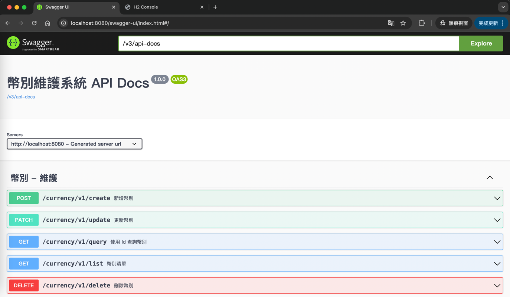
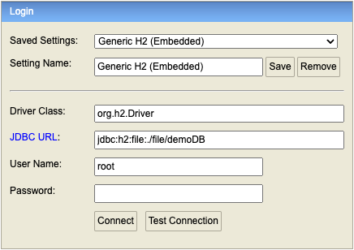

# Introduction
您好~ 我是 郭家君   
這是一個簡單的 幣別維護系統 實作，使用 Spring Boot 和 H2 數據庫來實現
(currency-maintenance-system)

# Getting Started
1. 編譯 ＆ 啟動專案 (使用 Maven, Java 8)
   - $ mvn clean install
   - $ mvn spring-boot:run
2. 成功啟動專案後
   - 因有下列設定，Table 應會自動建立
     - spring.jpa.generate-ddl=true 
     - spring.jpa.hibernate.ddl-auto=update
   - 也有預留 init.sql 裡的 DDL，檔案位於 src/main/resources 資料夾中
3. API 可以透過 Swagger UI 來 使用
   - http://localhost:8080 可直接 進入 Swagger UI
     - 有設定 (springdoc.swagger-ui.path=/) 直接轉導
   - 
4. 進入 Spring H2 Console
   - 網址 http://localhost:8080/h2
     - 有設定 => spring.h2.console.path=/h2
   - JDBC URL 請填 : jdbc:h2:file:./file/demoDB
     - 使用 file mode (重啟後，資料不會消失)
   - User name 請填 : root
   - 